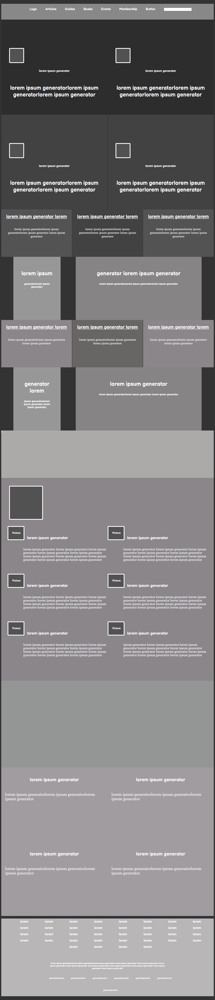

# smashingmagazine-Teardown
This project consists of building a heatmap of the [this](https://www.smashingmagazine.com/)

I created this project in the Workarea branch.

## Built With

HTML5
CSS

## [Live Link](https://rawcdn.githack.com/atenaiis/smashingmagazine-Teardown/2458241643c29a574d9c0e17c6019e53cbeff81f/style.html)

## Authors

👤 **Author1**

- Github: @atenaiis
- Twitter: @spranomarian

## Show your support

Give a ⭐️ if you like this project!

## Acknowledgments

Thanks to Team 123 Ocicats and Team 121 Ragdolls.

